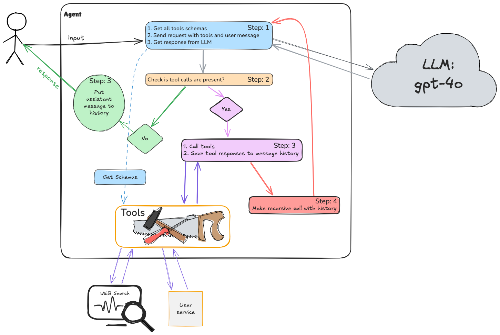

# DIAL AI Simple Agent Task
Python implementation for building AI-powered chat applications using the DIAL API with advanced tool integration.

## 🎯 Task Overview

Implement simple Agent from scratch that will work we User Service. In this task you need to practice to add custom tools and make requests to DIAL API.

## 🏗️ Architecture

### 
```
task/
├── models/
│   ├── conversation.py    ✅ Complete
│   ├── message.py         ✅ Complete
│   └── role.py            ✅ Complete
├── tools/                
│   ├── base.py            ✅ Abstract base tool interface
│   ├── web_search.py               ✅ TODO: implement all points described in TODO sections
│   └── user/                       
│       ├── base.py                 ✅ Abstraction for user service related tools
│       ├── create_user_tool.py     ✅ TODO: implement all points described in TODO sections
│       ├── update_user_tool.py     ✅ TODO: implement all points described in TODO sections
│       ├── delete_user_tool.py     ✅ TODO: implement all points described in TODO sections
│       ├── get_user_by_id_tool.py  ✅ TODO: implement all points described in TODO sections
│       ├── search_users_tool.py    ✅ TODO: implement all points described in TODO sections
│       └── models/           
│           └── user_info.py  ✅ Complete  
├── client.py   ✅ TODO: implement all points described in TODO seactions
├── prompts.py  ✅ TODO: provide system prompt
└── app.py      ✅ Add tool configs and play with different models
```

## 📋 Requirements

- **Python**: 3.11 or higher
- **Dependencies**: Listed in `requirements.txt`
- **API Access**: DIAL API key with appropriate permissions
- **Network**: EPAM VPN connection for internal API access
- **Docker**

## 🔧 Setup Instructions

### 1. Environment Setup

```bash
python -m venv .venv
```

### 2. Install Dependencies

```bash
pip install -r requirements.txt
```

### 3. API Configuration

1. **Connect to EPAM VPN** (required for internal API access)
2. **Obtain DIAL API Key**:
    - Visit: https://support.epam.com/ess?id=sc_cat_item&table=sc_cat_item&sys_id=910603f1c3789e907509583bb001310c
3. **Add DIAL API Key as Environment Variable**
4. **Run user service** (run `docker-compose.yml`)

### If the task in the main branch is hard for you, then switch to the `with-detailed-description` branch

## 🔍 API Reference

### DIAL Endpoint
```
POST https://ai-proxy.lab.epam.com/openai/deployments/{model}/chat/completions
```

### Request Format
```json
{
  "messages": [
    {
      "role": "system",
      "content": "You are a helpful assistant."
    },
    {
      "role": "user",
      "content": "Who is Andrej Karpathy?"
    }
  ],
  "tools": [
    {
      "type": "function",
      "function": {
        "name": "web_search_tool",
        "description": "Tool for WEB searching.",
        "parameters": {
          "type": "object",
          "properties": {
            "request": {
              "type": "string",
              "description": "The search query or question to search for on the web"
            }
          },
          "required": [
            "request"
          ]
        }
      }
    },
    {
      "type": "function",
      "function": {
        "name": "get_user_by_id",
        "description": "Provides full user information",
        "parameters": {
          "type": "object",
          "properties": {
            "id": {
              "type": "number",
              "description": "User ID"
            }
          },
          "required": [
            "id"
          ]
        }
      }
    },
    ...
  ]
}
```

### Response Format
With tool calls
```json
{
  "choices": [
    {
      "message": {
        "role": "assistant",
        "content": "",
        "tool_calls": [
          {
            "id": "call_6JriK7u5DL2heJ1lkw08WUFd",
            "function": {
              "arguments": "{\"request\":\"Andrej Karpathy profile\"}",
              "name": "web_search_tool"
            },
            "type": "function"
          }
        ]
      },
      "finish_reason": "tool_calls" 
    }
  ]
}
```

Final response:
```json
{
  "choices": [
    {
      "message": {
        "role": "assistant",
        "content": "Andrej Karpathy is..."
      },
      "finish_reason": "stop" 
    }
  ]
}
```
---
# 